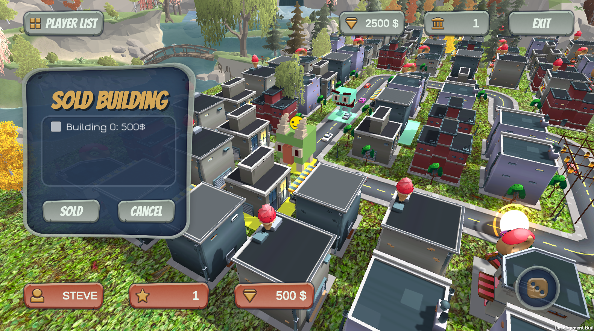
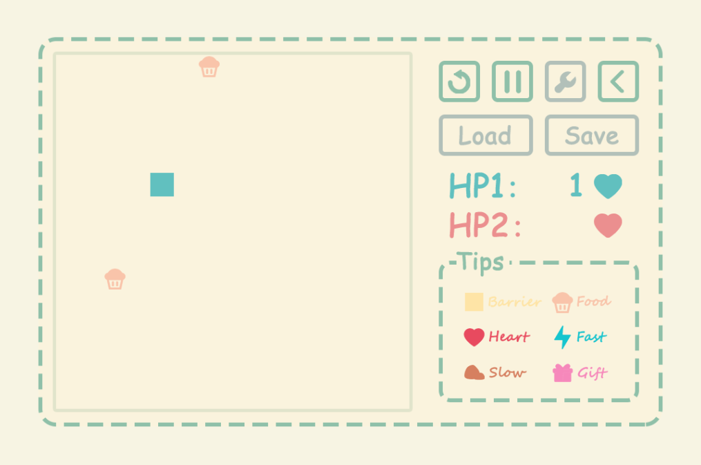

# Education

I’m an undergraduate student from **Shanghai Jiao Tong University**, majoring in **Software Engineering**. During my undergraduate study, I have participated in the coding work of some projects, and currently I'm doing some research on **Algorithmic Game Theory** under the supervision of [Prof. Zhenzhe Zheng](https://zhengzhenzhe220.github.io/).

---

# Projects

## My Firework 🎆

My Firework is an **AR Firework Education Project** in collaboration with the Shanghai Science and Technology Museum. It's mainly developed using **Unity Engine**, with an easy back-end component to support data transmission. This project won the **2nd Prize** in The 9th [China Digital Media Technology and Creativity Competition](http://mit.caai.cn/).

To see more about this project, please click [here](https://www.echoyixiao.cn/mySite/MyFirewroks/index.html).

## Poor Monopoly 🏠

Poor Monopoly is a **multi-players** 3D monopoly game project built with **Unity Engine**. It provides custom map function and some characters with different skills.

Click [here](https://github.com/Edersnow/SJTU_2019SE_Courses/tree/master/PPSE(Principles%20and%20Practice%20of%20Software%20Engineering)) to see the project's bundle.

## Snake 🐍

It's a normal snake game developed with **Qt**. In addition to the normal functionality, it adds some other features. The UI of this project is designed by myself using Photoshop with icons from [Iconfont](https://www.iconfont.cn/).

Click [here](https://github.com/Edersnow/SJTU_2019SE_Courses/tree/master/SEP(Software%20Engineering%20Practice)/proj1) to see this project and its DevelopDoc.

## Gobang AI 🎲

This is an naive Gobang AI implemented mainly using the **Minimax Search Algorithm**. The front-end is built using the **Flask Framework** in python and the UI is designed by myself using Photoshop.

To see the project, please click [here](https://github.com/Edersnow/Gobang).

